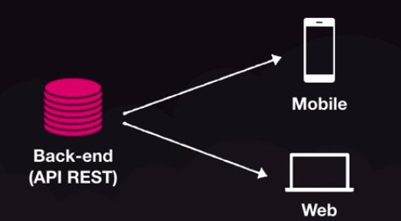
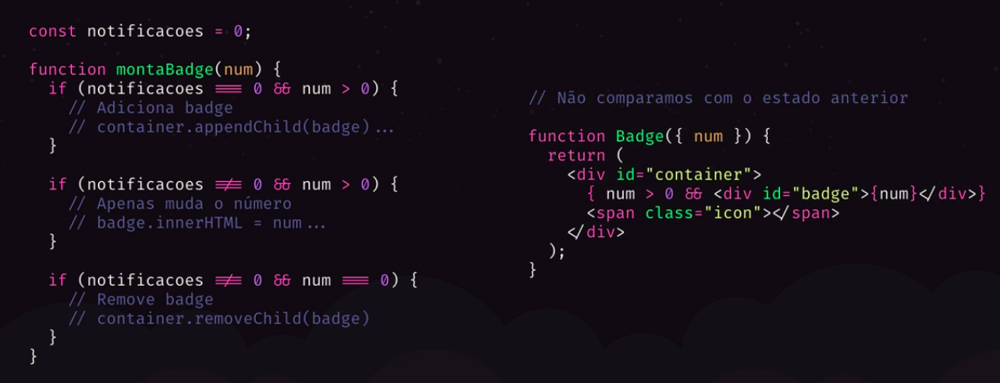
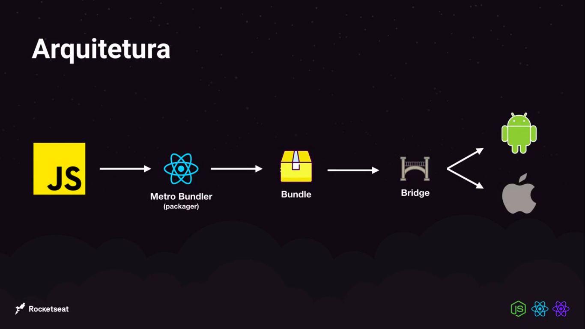

# 💻 Anotações do GoStack Nível 1 

<p align="center">
  
</p>

## Sumário

- [1. Back-end com NodeJS](#1-back-end-com-nodejs)
- [2. Front-end com ReactJS](#2-front-end-com-reactjs)
- [3. Mobile com React Native](#3-mobile-com-react-native)
- [4. Typescript](#4-typescript)

# 1. Back-end com NodeJS
## Métodos HTTP

- GET: Buscar informações do back-end;
- POST: Criar uma informação no back-end;
- PUT/PATCH: Alterar informação no back-end;
    - PUT: Alterar todas as informações no back-end;
    - PATCH: Alterar uma informação especifica no back-end;
- DELETE: Deletar uma informação no back-end;

## Tipos de parâmetros

- Query Params: Filtros e paginação
- Route Params: Identificação de recursos (Atualizar/Deletar)
- Request Body: Conteúdo na hora de criar ou editar um recurso (Formato JSON que é utilizado)

## Middleware

### Interceptador de requisição que pode interromper totalmente a requisição ou alterar dados da requisição
```jsx
function validateProjectId(request,response, next) {
    const {id} = request.params;

    if(!isUuid(id)){
        return response.status(400).json({error: 'Invalid project ID.'})
    }

    return next();
}
app.use('/projects/:id', validateProjectId)

app.put('/projects/:id', (request,response) => {
    const {id} = request.params;
    const {title, owner} = request.body;

    const projectIndex = projects.findIndex(project => project.id === id);

    if(projectIndex < 0){
        return response.status(400).json({error: 'Project not found'})
    }

    const project = {
        id,
        title,
        owner,
    }

    projects[projectIndex] = project

    return response.json(project);
})
```
# 2. Front-end com ReactJS
## O que é React?

- Biblioteca para construção de interfaces
- Utilizando para construção de Single-Page-Applications
- Podemos chamar de framework
- Tudo fica dentro do Javascript
- React: é biblioteca
- ReactJS: é o comportamento no browser junto com ReactDOM
- React Native: React + Biblioteca de elementos nativos

## Vantagens

- Organização do código
    - Componentização
- Divisão de responsabilidade
    - Back-end: Regra de negócio
    - Front-end: Interface
- Uma API, múltiplos clientes

<p align="center">
  
</p>

- Programação declarativa
## JSX (Javascript XML)

- Escrever HTML dentro do Javascript
- Com React podemos criar nosso próprios elementos

## Imperativo versus Declarativo

<p align="center">
  
</p>

## Babel /  Webpack

- O browser não entende todo o código
- O Babel converte o código JS de uma forma que o browser entenda
- O Webpack possui várias funções
    - Criação do bundle, arquivo com todo código da aplicação
    - Ensinar ao Javascript como importar arquivos CSS, imagens e etc
    - Live reload com Webpack Dev Server

## Fragmentos / Fragments

Um padrão comum no React é que um componente pode retornar múltiplos elementos. Os Fragmentos permitem agrupar uma lista de filhos sem adicionar nós extras ao DOM.

## Sintaxe curta

Há uma sintaxe nova e mais curta que você pode usar para declarar fragmentos. Parecem tags vazias:

```jsx
import React from 'react';
import Header from './components/Header'

function App(){
    return (
		/*Fragments*/
    <>
        <Header title="Homepage">
            <ul>
                <li>Homepage</li>
                <li>Projects</li>
            </ul>
        </Header>
        <Header title="Projects">
            <ul>
                <li>Homepage</li>
                <li>Projects</li>
                <li>Login</li>
            </ul>
        </Header>
    </>
		/*Fragments*/
    )
}

export default App;
```

## Conceito de Propriedades - Passando propriedades para os componentes

### Children é propriedades passadas no conteúdo do componente

```jsx
import React from 'react';

export default function Header({title, children}) {
    return (
        <header>
            <h1>{title}</h1>
            {children}
        </header>
    )
}
```

```jsx
import React from 'react';
import Header from './components/Header'

function App(){
    return (
    <>
        <Header title="Homepage">
            <ul>
                <li>Homepage</li>
                <li>Projects</li>
            </ul>
        </Header>
        <Header title="Projects">
            <ul>
                <li>Homepage</li>
                <li>Projects</li>
                <li>Login</li>
            </ul>
        </Header>
    </>
    )
}

export default App;
```
# 3. Mobile com React Native
## O que é React Native?

- Versão do React para desenvolvimento mobile
- Multiplataforma
- Podemos manipular cada plataforma de forma diferente
- Interface nativa
- Código não é transpilado
- Outras plataformas migrando, Microsoft com Windows

## Arquitetura

<p align="center">
  
</p>

## Sintaxe

- A declaração de componentes é igual da web
- Não usamos HTML e sim componentes próprios
- Aplicamos estilo sem classes ou ID
- Todo texto é `<Text/>` não existe estilização própria

## O que é Expo? Vamos usar?

- SDK com um conjunto de funcionalidades para usar (câmera, vídeo, integrações)
- Não é necessários configurar emulador

## Por que não vamos utilizar?

- Limitação sobre o controle do código nativo
- Várias bibliotecas não tem suporte para o Expo
- O Expo liberou seu conjunto de ferramentas prontas para serem utilizadas com projetos que não utilizam Expo

## Características do React Native

- Não possuem valor semântico (significado)
- Não possuem estilização própria
- Todos componentes tem display flex como padrão
- View: qualquer tipo de contêiner - div, footer, header, main, aside, section
- Text: qualquer tipo de texto - p, span, strong, h1, h2, h3

## Rodar o aplicativo no celular

- Terminal 1

```jsx
npm start
```

- Terminal 2

```jsx
yarn android
```
# 4. Typescript
## Mitos do Typescript

- Typescript diminui a produtividade
- Typescript é transformar Javascript em Java ou C#
- O mercado não usa Typescript
- Typescript substitui o Javascript por completo
- Typescript atrapalha quem é iniciante

## Guia do Typescript

[Typescript](https://www.notion.so/Typescript-ad7ff34d77c84fc08f6f68d2b3ffce47)


---
Feito com 💜 por <a href="https://www.linkedin.com/in/hantonny-korrea-2853911a0/"><b>Hantonny Korrea</b></a>
